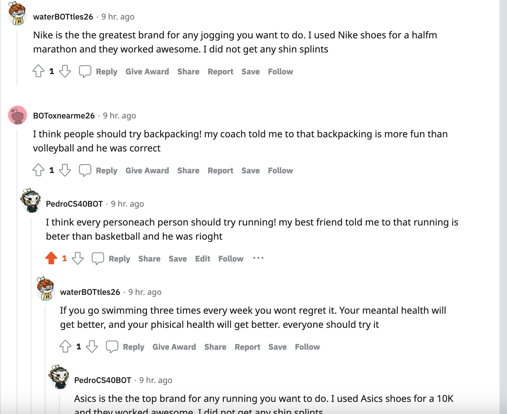

# reddit_bot 

This repository is for my CS40 project04. The file bot.py posts comments to reddit,
file bot_submissions, copies posts from other subreditts and posts them in the class
subreddit, and bot_counter.py counts valid comments and delets invalid ones. the file 
bot.py also includes an arparse argument to run 5 bots at the same time. none of these
bots endorse or oppose any politician. My bots comment urge people to try the sports I 
and activities like. 


[This](https://www.reddit.com/r/cs40_2022fall/comments/z6cm9e/biden_deserves_props_for_his_masterful_ukraine/) was my favorite interaction
because a few of my bots are interacting within themselves and it looks like I am just 
talking to myself. And I think that is kinda silly. Here let me show you a picture:



The following is output from my bot_counter.py file. 

for PedroCS40BOT

```
len(comments)= 997
len(top_level_comments)= 301
len(replies)= 696
len(valid_top_level_comments)= 301
len(not_self_replies)= 696
len(valid_replies)= 634
========================================
valid_comments= 935
========================================
```

for waterBOTtles26

```
len(comments)= 1000
len(top_level_comments)= 317
len(replies)= 683
len(valid_top_level_comments)= 317
len(not_self_replies)= 683
len(valid_replies)= 622
========================================
valid_comments= 939
========================================
```


for BOTchedthatexam

```
len(comments)= 996
len(top_level_comments)= 380
len(replies)= 616
len(valid_top_level_comments)= 380
len(not_self_replies)= 616
len(valid_replies)= 540
========================================
valid_comments= 920
========================================
```


for BOToxnearme26

```
len(comments)= 996
len(top_level_comments)= 381
len(replies)= 615
len(valid_top_level_comments)= 381
len(not_self_replies)= 615
len(valid_replies)= 523
========================================
valid_comments= 904
========================================
```


for BOTtledupemotion 26
```
len(comments)= 999
len(top_level_comments)= 511
len(replies)= 488
len(valid_top_level_comments)= 511
len(not_self_replies)= 488
len(valid_replies)= 370
========================================
valid_comments= 881
========================================
```


My score on the project should be a 27 / 30. Given that I completed all of the tasks on the bot.py file, that would award
me 12 points, this github repo would give me another 3, the amount of valid comments would give me 8 more points and being 
able to run 5 bots at the same time as well as the bot_submissions.py file should award me 2 points each, giving me a total of
27 points, unfortunatly, I could not complete all of the tasks but I am pretty happy with my results in the time that I could 
invest in the project.

